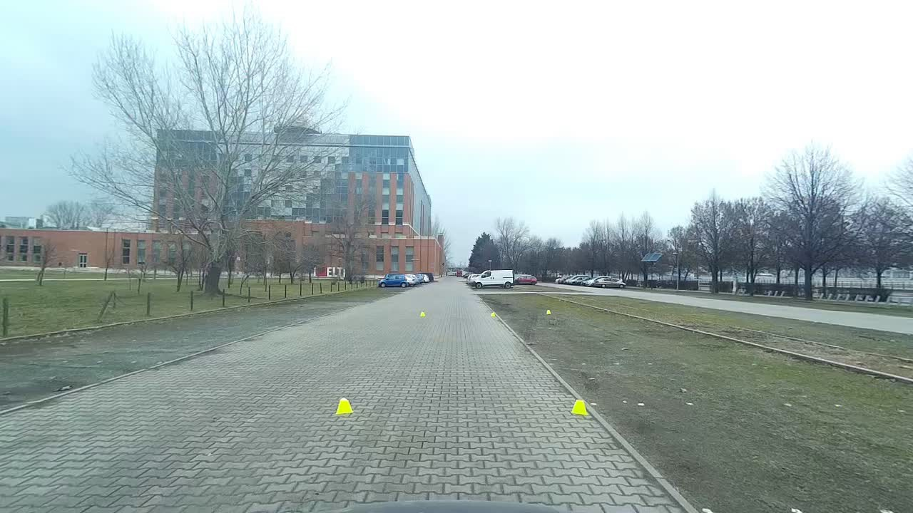
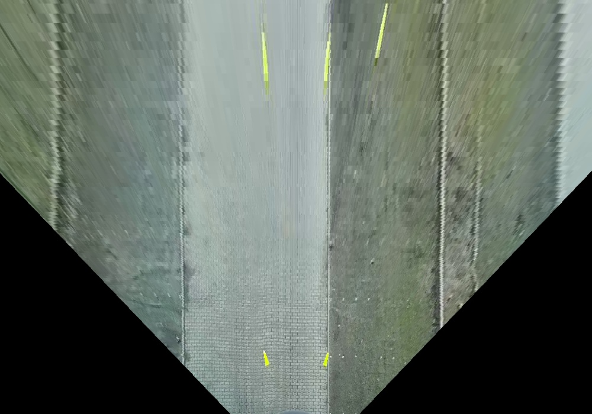

# Homography Transformer

## Parameters

- H: Homography matrix 3*3 (if you have the matrix stored in txt file, you can read it using the function HomographyTransformer::readMatrix)
- new_plane_width, new_plane_height: the new image dimensions
- multiplication_ratio: how much do you want to scale the output image (its value depend on your correspondences which you used to calculate the homography matrix), if the value is 1 then no scaling will be applied
- starting_x, starting_y: how many pixels do you want to translate the output image

## Build the app

```shell
mkdir build #if build directory is not exist
cd build
cmake ..
make
```

## Run app

```shell
./build/my_app homography_matrix_file input_image_path output_image_path output_width output_height multiplication_ratio starting_x starting_y
```

## Example

*Original image*


*Homography matrix*
```
-0.00362752 -0.00306944 3.51088 
-9.5107e-10 -0.044066 19.5212 
-7.82106e-11 -0.00257833 1 
```

*Run command*
```shell
./build/my_app files/homography.txt files/markers.jpg files/markers_output.jpg 1000 700 40 -450 -130
```

*Output image (1000 X 700)*

